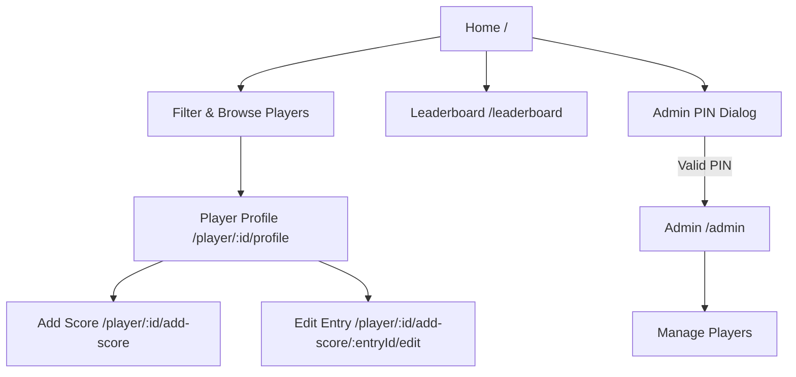
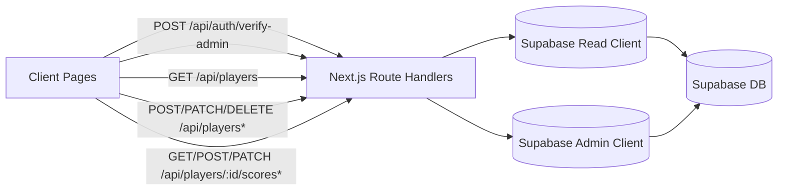
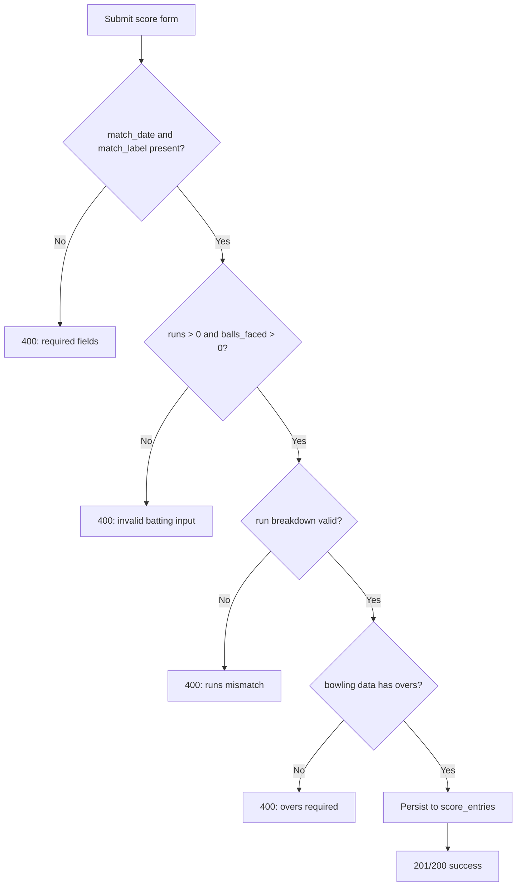

# CricScore

CricScore is a Next.js cricket score tracker for managing players, recording match entries, and viewing live leaderboard rankings for batting and bowling.

## Tech Stack

- Next.js 16 (App Router) + React 19
- TypeScript
- Supabase (`players`, `score_entries`, and related computed stats)
- Tailwind CSS 4

## Core Features

- Player listing with role-based filters (Batsman, Bowler, All-rounder)
- Add/update/delete players (admin flows)
- Per-player profile with aggregated stats and match history
- Add and edit score entries with server-side validations
- Leaderboard tabs for batting and bowling rankings

## App Flow



## API + Data Flow



## Score Entry Validation Flow



## Routes

| Route | Purpose |
| --- | --- |
| `/` | Player cards, filters, add player, admin access |
| `/leaderboard` | Batting and bowling ranking views |
| `/admin` | Player management (edit/delete/add) |
| `/player/[id]/profile` | Player stats + match history |
| `/player/[id]/add-score` | New score entry |
| `/player/[id]/add-score/[entryId]/edit` | Edit an existing score entry |

## API Endpoints

| Endpoint | Methods | Description |
| --- | --- | --- |
| `/api/auth/verify-admin` | `POST` | Verifies admin PIN |
| `/api/players` | `GET`, `POST` | List or create players |
| `/api/players/[id]` | `GET`, `PATCH`, `DELETE` | Read/update/delete player |
| `/api/players/[id]/scores` | `GET`, `POST` | List/create score entries |
| `/api/players/[id]/scores/[entryId]` | `GET`, `PATCH`, `DELETE` | Read/update/delete single score entry |

## Environment Variables

Create `.env.local`:

```bash
NEXT_PUBLIC_SUPABASE_URL=your_supabase_url
NEXT_PUBLIC_SUPABASE_ANON_KEY=your_supabase_anon_key
SUPABASE_SERVICE_ROLE_KEY=your_supabase_service_role_key
ADMIN_PIN=your_admin_pin
```

## Local Development

```bash
npm install
npm run dev
```

Open `http://localhost:3000`.
