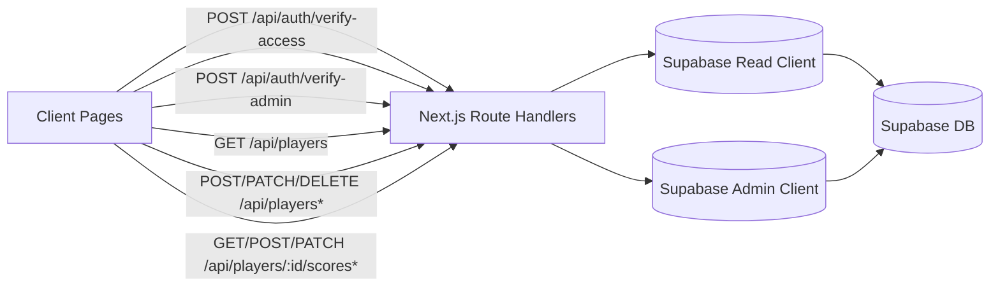
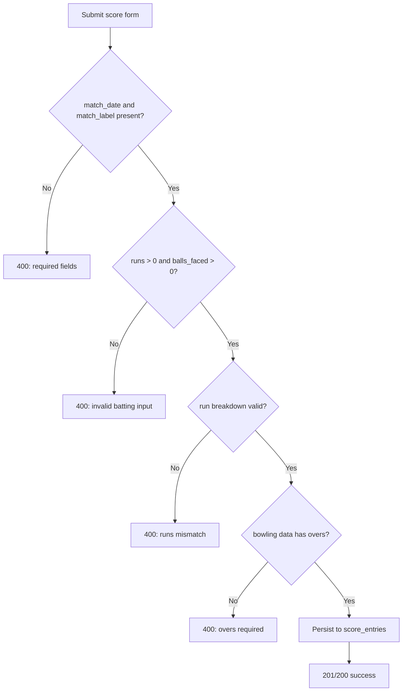

# CricScore

CricScore is a Next.js cricket score tracker for managing players, recording match entries, and viewing live leaderboard rankings for batting and bowling.

## Tech Stack

- Next.js 16 (App Router) + React 19
- TypeScript
- Supabase (`players`, `score_entries`, and related computed stats)
- Tailwind CSS 4

## Core Features

- Site-wide access gate with a PIN (`/access`), enforced by `proxy.ts`
- Admin PIN gate (`/admin-access`) for admin-only routes
- Player listing with role-based filters (Batsman, Bowler, All-rounder)
- Add/update/delete players (admin flows)
- Per-player profile with aggregated stats and match history
- Add and edit score entries with server-side validations
- Leaderboard tabs for batting and bowling rankings

## Access Control

Access is enforced server-side by `proxy.ts`. Cookies are `httpOnly` and set after a valid PIN is entered:

1. **Gate 1 — site access**: every route (except `/access`, `/admin-access`, and the verify APIs) requires the `cricscore_access` cookie. Unauthorized requests redirect to `/access`.
2. **Gate 2 — admin**: routes under `/admin*` additionally require the `cricscore_admin` cookie. Unauthorized requests redirect to `/admin-access`.

Verifying the admin PIN also grants the site access cookie, so a verified admin can reach `/admin` directly without first visiting `/access`. After a successful PIN entry the client performs a hard redirect (`window.location.href`) so the proxy re-evaluates the freshly set cookies on a fresh server request.

## App Flow

```mermaid
flowchart TD
  A[Any / route] --> B{Access PIN valid?}
  B -- No --> C[/access]
  B -- Yes --> D[Home /]
  D --> E[Filter & Browse Players]
  E --> F[Player Profile /player/:id/profile]
  F --> G[Add Score /player/:id/add-score]
  F --> H[Edit Entry /player/:id/add-score/:entryId/edit]
  D --> I[Leaderboard /leaderboard]
  D --> J{Admin PIN valid?}
  J -- No --> K[/admin-access]
  J -- Yes --> L[Admin /admin]
  L --> M[Manage Players]
```

## API + Data Flow


```mermaid
flowchart LR
  UI[Client Pages] --> API[Next.js Route Handlers]
  API --> R[(Supabase Read Client)]
  API --> W[(Supabase Admin Client)]
  R --> DB[(Supabase DB)]
  W --> DB

  UI -->|POST /api/auth/verify-access| API
  UI -->|POST /api/auth/verify-admin| API
  UI -->|GET /api/players| API
  UI -->|POST/PATCH/DELETE /api/players*| API
  UI -->|GET/POST/PATCH /api/players/:id/scores*| API
```

## Score Entry Validation Flow


```mermaid
flowchart TD
  A[Submit score form] --> B{match_date and match_label present?}
  B -- No --> E1[400: required fields]
  B -- Yes --> C{runs > 0 and balls_faced > 0?}
  C -- No --> E2[400: invalid batting input]
  C -- Yes --> D{run breakdown valid?}
  D -- No --> E3[400: runs mismatch]
  D -- Yes --> F{bowling data has overs?}
  F -- No --> E4[400: overs required]
  F -- Yes --> G[Persist to score_entries]
  G --> H[201/200 success]
```

## Routes

| Route | Purpose |
| --- | --- |
| `/access` | Site-wide access PIN gate |
| `/admin-access` | Admin PIN gate |
| `/` | Player cards, filters, add player, admin access |
| `/leaderboard` | Batting and bowling ranking views |
| `/admin` | Player management (edit/delete/add) |
| `/player/[id]/profile` | Player stats + match history |
| `/player/[id]/add-score` | New score entry |
| `/player/[id]/add-score/[entryId]/edit` | Edit an existing score entry |

## API Endpoints

| Endpoint | Methods | Description |
| --- | --- | --- |
| `/api/auth/verify-access` | `POST` | Verifies access PIN, sets `cricscore_access` cookie |
| `/api/auth/verify-admin` | `POST` | Verifies admin PIN, sets `cricscore_admin` cookie |
| `/api/players` | `GET`, `POST` | List or create players |
| `/api/players/[id]` | `GET`, `PATCH`, `DELETE` | Read/update/delete player |
| `/api/players/[id]/scores` | `GET`, `POST` | List/create score entries |
| `/api/players/[id]/scores/[entryId]` | `GET`, `PATCH`, `DELETE` | Read/update/delete single score entry |

## Environment Variables

Create `.env.local`:

```bash
NEXT_PUBLIC_SUPABASE_URL=your_supabase_url
NEXT_PUBLIC_SUPABASE_ANON_KEY=your_supabase_anon_key
SUPABASE_SERVICE_ROLE_KEY=your_supabase_service_role_key
ACCESS_PIN=your_access_pin
ADMIN_PIN=your_admin_pin
```

## Local Development

```bash
npm install
npm run dev
```

Open `http://localhost:3000`.
