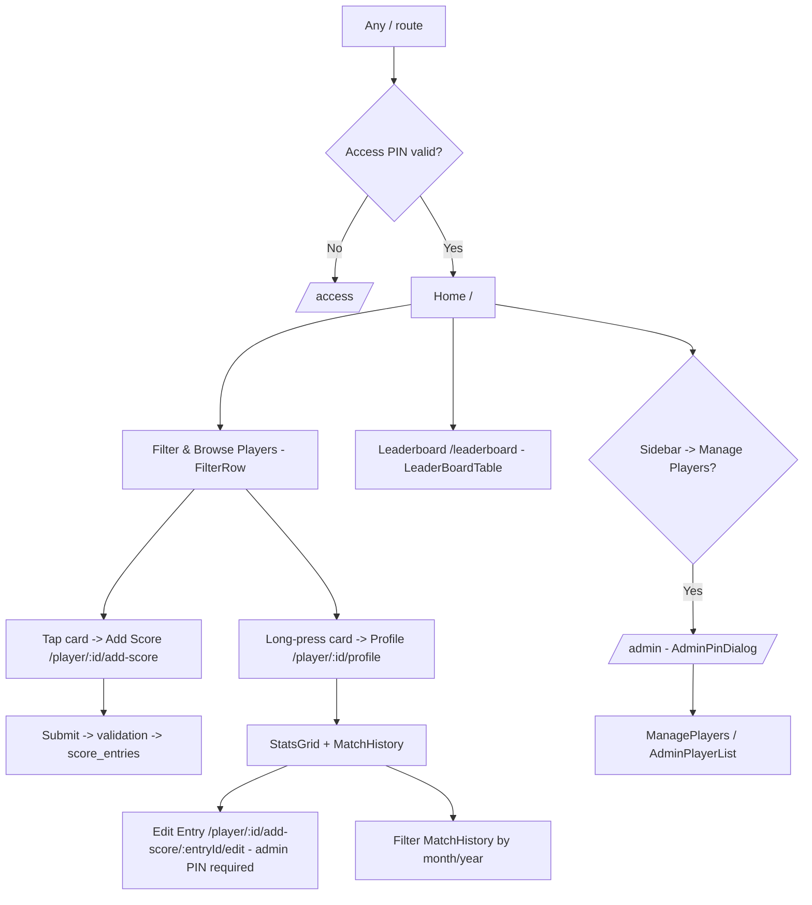
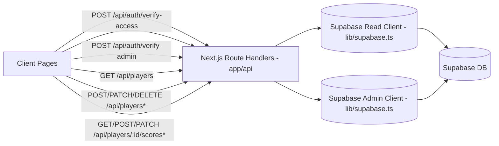
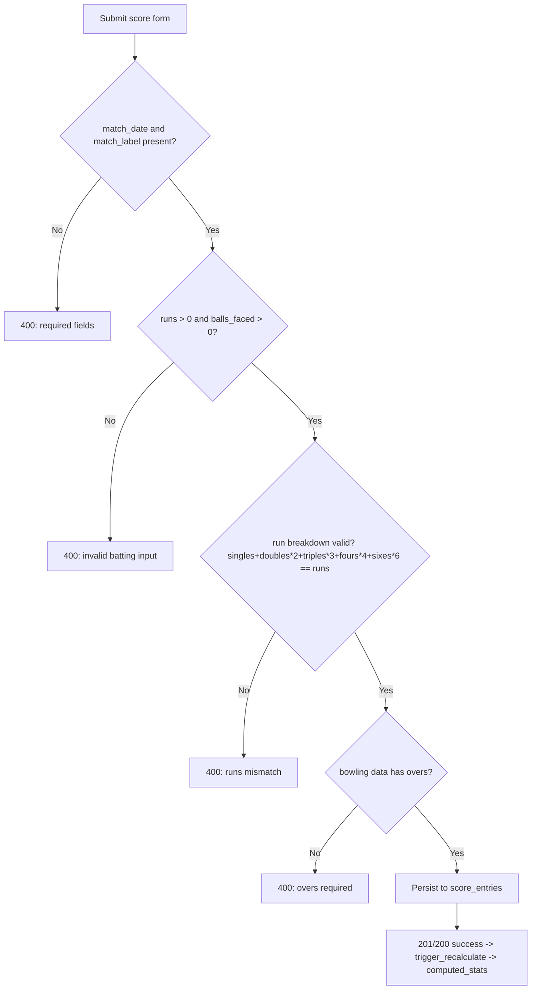

# CricScore

CricScore is a mobile-first Next.js cricket score tracker for managing players, recording per-match batting/bowling entries, and viewing live leaderboard rankings. Built for the **THUNDERBOLTS** team.

## Tech Stack

- **Framework:** Next.js 16 (App Router) + React 19 + TypeScript (strict)
- **Database:** Supabase + PostgreSQL (`players`, `score_entries`, `computed_stats` via triggers)
- **Styling:** Tailwind CSS 4, `font-sans` for player names, `font-mono` elsewhere; zinc (general), cyan (batting), purple (bowling)
- **Icons:** `lucide-react`
- **Animations:** `motion`
- **Notifications:** `sonner` (Toaster)
- **Analytics:** `@vercel/analytics`
- **PWA:** `public/manifest.json` + `public/sw.js` registered in `app/layout.tsx`

## Core Features

- Site-wide access gate with a 5-digit PIN (`/access`), enforced by `proxy.ts` (30-day `httpOnly` cookie)
- Admin gate (`/admin-access` + `AdminPinDialog`) for `/admin` and score-entry edits — stateless, re-prompted every visit
- Player listing with role filters (Batsman, Bowler, All-rounder) via `FilterRow`
- Add players (any authenticated user) with expanded style selects; edit/delete players (admin only)
- Per-player profile (`/player/[id]/profile`) with `ProfileHeader`, `StatsGrid`, and filtered `MatchHistory`
- Add score (`/player/[id]/add-score`) and edit score (`/player/[id]/add-score/[entryId]/edit`) with server-side run-breakdown validation
- Leaderboard (`/leaderboard`) with `LeaderBoardTable` — sticky name column, horizontally scrollable stats, rank-1 highlighted
- Match History filter by month + year (`ListFilter` button + dialog)
- Player batting/bowling style display (`Right/Left-hand bat • Right/Left-arm {Fast,Medium,Off spin,…}`)
- Single-tap to add score / long-press to view profile (`app/hooks/useLongPress.ts` with scroll/move guards)
- Overlay Sidebar (`components/ui/Sidebar.tsx`) triggered from `TopNav` — menus: Overall Stats (`/leaderboard`), Manage Players (`/admin`)

## Access Control

Enforced by `proxy.ts:3` (site-wide) plus the admin dialog on `/admin`:

1. **Site access:** every route except `/access`, `/admin-access`, `/api/auth/verify-access`, `/api/auth/verify-admin` requires `cricscore_access=granted`. Missing cookie → `302 /access`. Set by `POST /api/auth/verify-access` (`app/api/auth/verify-access/route.ts:16`) with `maxAge: 30 days`, `httpOnly`, `sameSite: lax`.
2. **Admin access:** `/admin` renders `AdminPinDialog` on every visit; verification calls `POST /api/auth/verify-admin` (`app/api/auth/verify-admin/route.ts:14`). **No persistent `cricscore_admin` cookie is used** — access is not remembered (see `context/project-overview.md:5`). The current `verify-admin` handler re-sets `cricscore_access` for 1 minute as a side-effect; `proxy.ts` does not check a separate admin cookie.

## App Flow


```mermaid
flowchart TD
  A[Any / route] --> B{Access PIN valid?}
  B -- No --> C[/access/]
  B -- Yes --> D[Home /]
  D --> E[Filter & Browse Players - FilterRow]
  E --> F[Tap card -> Add Score /player/:id/add-score]
  E --> G[Long-press card -> Profile /player/:id/profile]
  F --> H[Submit -> validation -> score_entries]
  G --> I[StatsGrid + MatchHistory]
  I --> J[Edit Entry /player/:id/add-score/:entryId/edit - admin PIN required]
  I --> K[Filter MatchHistory by month/year]
  D --> L[Leaderboard /leaderboard - LeaderBoardTable]
  D --> M{Sidebar -> Manage Players?}
  M -- Yes --> N[/admin - AdminPinDialog/]
  N --> O[ManagePlayers / AdminPlayerList]
```

## Player Card Interaction

`app/hooks/useLongPress.ts:1` distinguishes tap vs long-press with a 300 ms delay, `MOVEMENT_THRESHOLD:15px`, and scroll cancellation — fixes the home-screen scrolling/redirecting bug.

- **Tap** (`onShortPress`) → `router.push('/player/[id]/add-score')`
- **Long-press** (`onLongPress`) → `router.push('/player/[id]/profile')`

## API + Data Flow


```mermaid
flowchart LR
  UI[Client Pages] --> API[Next.js Route Handlers - app/api]
  API --> R[(Supabase Read Client - lib/supabase.ts)]
  API --> W[(Supabase Admin Client - lib/supabase.ts)]
  R --> DB[(Supabase DB)]
  W --> DB

  UI -->|POST /api/auth/verify-access| API
  UI -->|POST /api/auth/verify-admin| API
  UI -->|GET /api/players| API
  UI -->|POST/PATCH/DELETE /api/players*| API
  UI -->|GET/POST/PATCH /api/players/:id/scores*| API
```

`GET /api/players` (`app/api/players/route.ts:20`) now does a single `players` + `computed_stats` query plus a single `score_entries` query, then aggregates `derived_stats` in JS (no N+1):

- `computed_stats` fields: `games_played`, `total_runs`, `total_wickets`, `batting_avg`, `strike_rate`, `bowling_avg`, `economy`, `highest_score`, `best_figures`
- `derived_stats` (`types/leaderboardProps.ts:1`): `batInnings`, `ballsFaced`, `fours`, `sixes`, `notOuts`, `bowlInnings`, `oversBowled`, `runsGiven`, `threeWi`, `fiveWi`

Leaderboard sorting is client-side in `app/leaderboard/page.tsx:77`: batting by `total_runs → batting_avg → strike_rate → batInnings ASC`; bowling by `total_wickets → economy ASC → bowling_avg ASC → best_figures`.

## Score Entry Validation Flow


```mermaid
flowchart TD
  A[Submit score form] --> B{match_date and match_label present?}
  B -- No --> E1[400: required fields]
  B -- Yes --> C{runs > 0 and balls_faced > 0?}
  C -- No --> E2[400: invalid batting input]
  C -- Yes --> D{run breakdown valid? singles+doubles*2+triples*3+fours*4+sixes*6 == runs}
  D -- No --> E3[400: runs mismatch]
  D -- Yes --> F{bowling data has overs?}
  F -- No --> E4[400: overs required]
  F -- Yes --> G[Persist to score_entries]
  G --> H[201/200 success -> trigger_recalculate -> computed_stats]
```

Validation lives in `app/api/players/[id]/scores/route.ts` and `app/api/players/[id]/scores/[entryId]/route.ts`. `match_date` + `match_label` is `UNIQUE` per player (`db/schema.sql:57`); `match_date`/`match_label` are immutable on edit.


## Database Schema

`db/schema.sql:1`:

| Table | Key Columns |
|---|---|
| `players` | `id uuid PK`, `name text`, `role check(Batsman/Bowler/All-rounder)`, `batting_hand`, `bowling_hand`, `bowling_style`, `created_at`, trigger `on_player_created → create_computed_stats()` |
| `score_entries` | `id`, `player_id FK CASCADE`, `match_date date`, `match_label text`, `runs/balls_faced/singles/doubles/triples/fours/sixes`, `how_out/not_out`, `overs_bowled numeric(4,1)/runs_given/wickets/maidens`, `UNIQUE(player_id, match_date, match_label)`, trigger `on_score_change → trigger_recalculate()` |
| `computed_stats` | `player_id UNIQUE FK CASCADE`, `total_runs/wickets`, `batting_avg/strike_rate/bowling_avg/economy`, `highest_score`, `best_figures`, `games_played`, `last_updated` |

## Routes

| Route | Purpose |
|---|---|
| `/access` | Site-wide 5-digit PIN gate |
| `/admin-access` | Admin 4-digit PIN gate (standalone page) |
| `/` | Player cards grid, `FilterRow`, `AddPlayerCard`/`AddPlayerDialog`, `TopNav` + `Sidebar` |
| `/leaderboard` | Batting/Bowling `LeaderBoardTable` with `LeaderBoardTabs` |
| `/admin` | `ManagePlayers` — edit `name`/`role`/`batting_hand`/`bowling_hand`/`bowling_style`, delete player (admin PIN dialog) |
| `/player/[id]/profile` | `ProfileHeader` + `StatsGrid` + `MatchHistory` (filterable) |
| `/player/[id]/add-score` | `ScoreHeader` + `DateMatchRow` + `StatInputCard` + `ScoreAction` — create entry |
| `/player/[id]/add-score/[entryId]/edit` | Edit existing entry (match_date/label read-only) + delete entry |

`components/ui/Sidebar.tsx:24` currently returns `null` outside `/` (only homepage shows the hamburger), though `context/feature-specs/create-sidebar.md` intended it on all routes — TopNav is present on other routes but the trigger is home-only. `BottomNav` (`app/components/BottomNav.tsx`) has been removed.

## API Endpoints

| Endpoint | Methods | Description |
|---|---|---|
| `/api/auth/verify-access` | `POST` | Verifies `ACCESS_PIN`, sets `cricscore_access` (`30d`) |
| `/api/auth/verify-admin` | `POST` | Verifies `ADMIN_PIN` (re-sets `cricscore_access` for 1 min; no admin cookie) |
| `/api/players` | `GET` | List players + `computed_stats` + `derived_stats` (single-query aggregation) |
| `/api/players` | `POST` | Create player `{name, role, batting_hand, bowling_hand, bowling_style}` |
| `/api/players/[id]` | `GET`, `PATCH`, `DELETE` | Read/update/delete player (style fields with migration fallback) |
| `/api/players/[id]/scores` | `GET`, `POST` | List/create score entries |
| `/api/players/[id]/scores/[entryId]` | `GET`, `PATCH`, `DELETE` | Read/update/delete single entry (includes delete-score flow + toast) |

All handlers use `supabase` (anon) for reads and `supabaseAdmin` (service role) for writes, with input validation at the boundary.

## Project Structure

```
cricscore/
├── proxy.ts                          # site-wide cookie gate (matcher excludes _next/static, etc.)
├── next.config.js
├── app/
│   ├── layout.tsx                    # fonts (Geist/Rajdhani/Share_Tech_Mono), Toaster, Analytics, SW registration, manifest
│   ├── page.tsx                      # home: fetch /api/players, FilterRow, PlayerCardWrapper grid
│   ├── access/page.tsx               # 5-digit PIN form
│   ├── admin-access/page.tsx         # 4-digit PIN form
│   ├── admin/page.tsx                # admin panel (AdminPinDialog + ManagePlayers)
│   ├── leaderboard/page.tsx          # Overall Stats: tabs + LeaderBoardTable (sorting)
│   ├── player/[id]/profile/page.tsx # fetch player + entries, ProfileHeader/StatsGrid/MatchHistory
│   ├── player/[id]/add-score/page.tsx
│   ├── player/[id]/add-score/[entryId]/edit/page.tsx
│   ├── hooks/useLongPress.ts
│   └── api/
│       ├── auth/verify-access/route.ts
│       ├── auth/verify-admin/route.ts
│       └── players/
│           ├── route.ts
│           ├── [id]/route.ts
│           └── [id]/scores/
│               ├── route.ts
│               └── [entryId]/route.ts
├── components/
│   ├── ui/  
│   ├── admin/ 
│   ├── leaderboard/ 
│   ├── profile/ 
│   └── addScore/ 
├── lib/  supabase.ts, constants.ts, playerStyles.ts, utils.ts
├── types/ leaderboardProps.ts, playerCardProps.ts, profileHeaderProps.ts, statsGridProps.ts
├── db/schema.sql
├── context/ project-overview.md, architecture-context.md, code-standards.md,
│            ai-workflow-rules.md, progress-tracker.md, feature-specs/
└── public/ logo.png, manifest.json, sw.js
```

See also `AGENTS.md` and `context/architecture-context.md` for boundaries and invariants.

## Environment Variables

Create `.env.local`:

```bash
NEXT_PUBLIC_SUPABASE_URL=your_supabase_url
NEXT_PUBLIC_SUPABASE_ANON_KEY=your_supabase_anon_key
SUPABASE_SERVICE_ROLE_KEY=your_supabase_service_role_key
ACCESS_PIN=5_digit_site_pin
ADMIN_PIN=4_digit_admin_pin
```

Never commit `.env.local`; see Boundaries below.

## Local Development

```bash
npm install
npm run dev      # http://localhost:3000
npm run build    # type-check + Next.js build
npm run lint -- --fix
npm run format   # Prettier
```

PWA: `npm run build` + serve requires `manifest.json`/`sw.js` under `public/`.


## Boundaries & Do Not Touch

- Never modify `.env` / `.env.local` via tooling; never edit `.next/`; never edit `package-lock.json` directly.
- Do not place app logic in `public/`.
- `components/ui/*` are foundation components — keep reusable, put feature logic in app-level components.

## Verification

```bash
npm run build   # must pass
npx tsc --noEmit
npx eslint components/leaderboard/LeaderBoardTable.tsx components/profile/MatchHistory.tsx --ext .ts,.tsx
```
